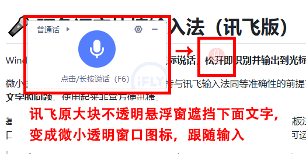

# 🎤 阿色语音快捷输入法（讯飞版）

Windows 屏幕常驻语音输入法：**按住鼠标说话，松开即识别并输出到光标处**。

长按鼠标左键呼出输入按钮，在保持与讯飞输入法同等准确性的前提下，**解决讯飞输入法自带的大块悬浮窗口遮盖文字的问题**。使用起来非常方便迅捷。

基于讯飞开放平台「语音听写 iat」引擎，识别结果通过模拟键盘/剪贴板注入到任意应用——记事本、浏览器、聊天窗口、办公软件均可使用。打包为单文件 exe，无需安装 Python 环境即可运行。

> **特色**：零学习成本的长按说话交互 · 单文件免安装 · 支持开机自启 · 语音速记模式

> 🔗 **GitHub 仓库**：[arthurqwang/ArthurVoiceInput](https://github.com/arthurqwang/ArthurVoiceInput)

---

## ✨ 功能特性

| 特性 | 说明 |
|---|---|
| 🖱️ 长按说话 | 在任意输入位置长按鼠标左键（约 0.3s）呼出浮窗，按住说话、松手识别 |
| 🎙️ 讯飞 iat 引擎 | 16kHz 音频 WebSocket 实时听写，中文识别稳定 |
| ⌨️ 三种注入模式 | `clipboard`（Ctrl+V 粘贴，默认）/ `type`（底层键盘模拟）/ `kb`（语音速记到 markdown 文件） |
| 🔑 全局热键 | `Ctrl+Alt+Space` 按住也可录音 |
| 🚀 单文件 exe | PyInstaller 打包，脱离 Python 环境独立运行（约 33MB） |
| 🔄 智能重启 | 右键菜单「重启」一键重启，配置改动即时生效 |
| 🌅 开机自启 | 配置窗口勾选即写注册表；exe 每次启动自检自愈（改名/移动后自动修正） |
| 📡 代理友好 | 自动读取 `HTTPS_PROXY` / `HTTP_PROXY` 走代理（适配内网） |



---

## 🚀 快速开始

### 方式一：直接使用（推荐）

1. 下载 [Releases](https://github.com/arthurqwang/ArthurVoiceInput/releases) 中的 `ArthurVoiceInput.exe`（64 位 Windows 8.1+）
2. 双击运行，屏幕出现淡红色麦克风小圆饼
3. 首次使用需配置讯飞密钥（见下），**免费额度每日 500 次**

### 申请讯飞密钥（免费）

1. 打开 <https://www.xfyun.cn> 注册账号
2. 控制台 → 创建应用 → **语音听写 iat**
3. 获取 `APPID` / `APIKey` / `APISecret` 三项
4. 右键输入法图标 → 「配置」→ 填入三项密钥 → 保存（重启后生效）

### 使用方法

1. 在欲输入位置**长按鼠标左键**（约 0.3 秒），呼出输入图标
2. **按住图标说话** → 说完松手
3. 识别结果自动输出到当前光标位置
4. 隐藏后，再次长按鼠标左键即可重新呼出
5. 快捷热键：按住 Ctrl+Alt+Space 说话，松手同样识别输出。

---

## 🔧 从源码运行（开发者）

### 环境要求

- Python 3.13（需带 tkinter）
- 麦克风 + 网络

### 安装与运行

```bash
pip install -r requirements.txt
python voice_input.py
```

### 环境变量（可选）

| 变量 | 默认值 | 说明 |
|---|---|---|
| `VI_MODE` | `clipboard` | 注入方式：`clipboard` / `type` / `kb` |
| `VI_KB_DIR` | `./voice_notes` | kb 模式落盘目录（语音速记文件） |
| `XFYUN_APPID` | — | 讯飞密钥（也可写入同目录 `xfyun_config.ini`） |
| `XFYUN_APIKEY` | — | 同上 |
| `XFYUN_APISECRET` | — | 同上 |

> 凭证优先级：环境变量 > `xfyun_config.ini`（格式见 `[xfyun]` 段）

### 打包为单文件 exe

```bash
pip install pyinstaller
python build_exe.py        # 产物：dist/ArthurVoiceInput.exe
```

打包完成后会自动同步开机自启动注册表（若已启用），exe 启动时也会自检修正自启动路径。

---

## 📁 项目结构

```
ArthurVoiceInput/
├── voice_input.py      # 主程序：浮窗 UI / 录音 / 注入 / 菜单 / 自启动
├── xfyun_asr.py        # 讯飞 iat WebSocket 引擎（鉴权 / 代理 / 重试）
├── build_exe.py        # PyInstaller 打包脚本
├── requirements.txt    # Python 依赖
├── run_xfyun.bat       # 一键启动脚本（读 xfyun_config.ini 凭证）
├── AVI_logo28.png      # 浮窗 idle 图标 / 窗口图标
├── AVI_logo.ico        # exe 图标（由 AVI_logo.png 生成）
└── dist/               # 打包产物（ArthurVoiceInput.exe）
```

---

## ❓ 常见问题（FAQ）

**Q：杀毒软件误报？**
A：单文件 exe 未做代码签名，360/Defender 等可能误报，添加信任即可；面向公众大规模分发可考虑代码签名。

**Q：首次启动慢？**
A：单文件 exe 每次启动需解压到临时目录（约 3~10 秒），属正常；常驻运行后无影响。

**Q：识别为空或乱码？**
A：确认麦克风正常、网络畅通、说话清晰；讯飞对低音量前段易"脑补"乱码，可适当靠近麦克风。

**Q：免费额度多少？**
A：讯飞每日免费 500 次，每次最长 60 秒。

**Q：exe 改名/移动后开机自启动失效？**
A：不会。exe 每次启动自动自检，若自启动项未指向当前 exe 会自动修正；`build_exe.py` 打包后也会自动同步。

---

## 🧠 技术要点

- **讯飞鉴权**：HMAC-SHA256 生成 `authorization`，WSS 握手（`iat-api.xfyun.cn/v2/iat`）
- **代理适配**：内网环境手动 CONNECT 建隧道 + 手包 TLS，规避企业代理对 WSS 空闲的秒断
- **稳定性**：3 次退避重试；普通模式（非 dwa=wpgs）避免短句拼接乱码
- **注入链路**：KEYEVENTF_UNICODE → Ctrl+V → WM_PASTE → PostMessage 四级降级
- **浮窗渲染**：`UpdateLayeredWindow` per-pixel alpha 半透明圆饼，录音波形动画

---

## 🙏 作者与社区

- 作者：**阿色（Arthur）**，大系统观
- 官网：<https://www.holomind.com.cn>（大系统观开放论坛）

欢迎 Star ⭐、Issue 反馈与 PR 共建！

---

## 📄 License

[MIT](LICENSE) © 2026 Arthur Wang
